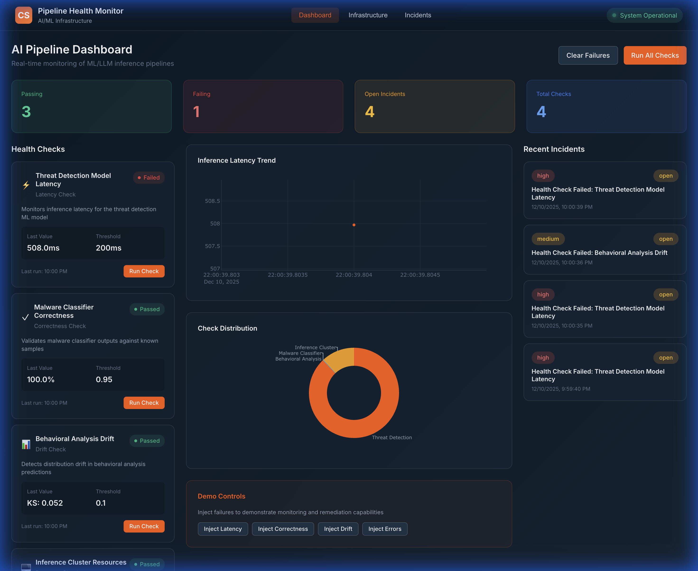
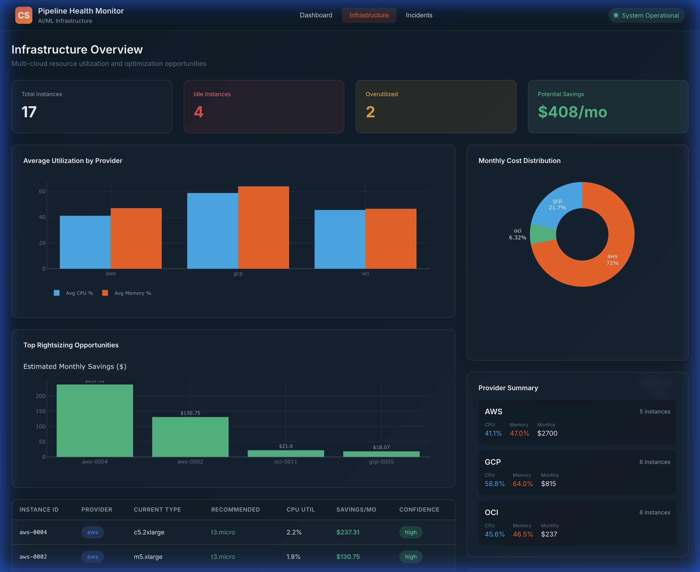
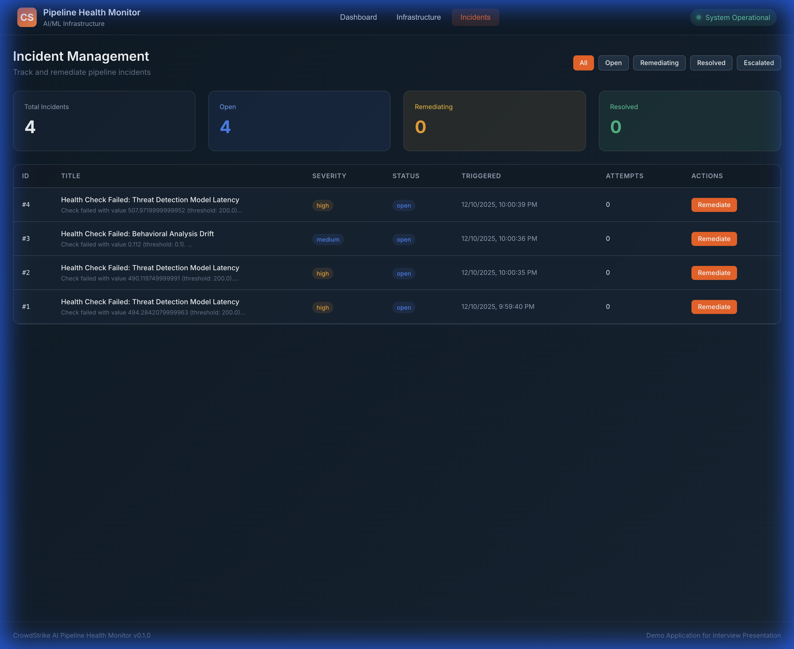

# CrowdStrike AI Pipeline Health Monitor

> **Proactive Health Monitoring, Automated Remediation, and Cost Optimization for Mission-Critical AI Systems**



## Overview for Production Systems

In high-stakes environments like CrowdStrike's production systems, AI model reliability is non-negotiable. The **AI Pipeline Health Monitor** is designed to provide a unified, single-pane-of-glass view into the structural integrity of deployed ML models.

Unlike traditional infrastructure monitoring (CPU/Memory), this system focuses on **model-specific signals**:
*   **Inference Latency**: Automatically detects regression in P99 latency.
*   **Drift Detection**: Uses statistical tests (KS-test) to identify input data distribution shifts.
*   **Correctness Checks**: Validates model output against ground truth or confidence thresholds.

Crucially, it implements **Automated Remediation**, reducing the "biological toll" on on-call engineers by automatically attempting self-healing strategies (restart, cache clear, rollback) before paging a human.

## Dashboard Tour

### 1. Unified Health Dashboard
The central command center provides real-time status of all critical models. It aggregates passing/failing checks and visualizes latency trends over time.


**Key Insights:**
*   **Health Cards**: Instant Red/Green status for distinct failure modes (Latency, Drift, Correctness).
*   **Live Metrics**: Real-time visualization of inference performance.
*   **One-Click Actions**: Manually trigger health checks or clear system state directly from the UI.

### 2. Multi-Cloud Infrastructure & Rightsizing
A detailed view of the underlying compute resources across AWS, GCP, and OCI simulation. 



**Value for Engineering:**
*   **Rightsizing Recommendations**: Automatically analyzes utilization to suggest cost-saving instance downgrades.
*   **Cost Analysis**: Estimated hourly and monthly burn rates by provider.
*   **Utilization Heatmap**: Quickly identify idle or over-provisioned resources.

### 3. Incident Management & Remediation
When a health check fails, an incident is automatically created. This view tracks the lifecycle of that alert.



**Automated Ops:**
*   **Auto-Creation**: Incidents are generated immediately upon check failure (as shown in the screenshot with "Threat Detection Model Latency").
*   **Severity Grading**: Criticality is automatically assigned based on the failing check type (e.g., Correctness = Critical, Latency = High).
*   **Remediation History**: precise audit trail of automated actions taken (e.g., "Restarted Service").

---

## Technical Architecture & Stack

This project maps to a modern, scalable production stack suitable for high-volume enterprise environments.

### Backend (Python/FastAPI)
*   **FastAPI**: High-performance async web framework.
*   **SQLAlchemy**: Robust ORM for reliable database interactions (SQLite for demo, PostgreSQL ready).
*   **Prometheus**: Exporting metrics for observability integration.
*   **Pandas/SciPy**: Used for statistical drift detection and data analysis.

### Frontend (React/TypeScript)
*   **Vite**: Next-generation frontend tooling for instant dev server start.
*   **TypeScript**: Type-safe development for maintainable codebases.
*   **Plotly.js**: Interactive, data-dense charting library.
*   **CrowdStrike Theme**: Custom CSS implementation matching enterprise design systems.

### Ops & Deployment
*   **Docker**: Fully containerized services for consistent deployment.
*   **Docker Compose**: Orchestration for local development and demo environments.
*   **REST API**: Fully documented Open API (Swagger) interface.

---

## Quick Start (Demo Mode)

**1. Clone and Setup**
```bash
git clone https://github.com/michaelromero212/Crowdstrike-AI-Pipeline-Health-Monitor.git
cd Crowdstrike-AI-Pipeline-Health-Monitor
cp infra/localsample.env backend/.env
```

**2. Start Services**
```bash
# Terminal 1: Backend
cd backend
python3 -m venv venv
source venv/bin/activate
pip install -r requirements.txt
uvicorn app.main:app --reload --port 8000

# Terminal 2: Frontend
cd frontend
npm install
npm run dev
```

**3. Access Dashboard**
Open [http://localhost:3000](http://localhost:3000)

**4. Run Demo Scenario**
Use the **Demo Controls** on the dashboard to inject failures (e.g., "Inject Latency") and watch the system detect and respond.
